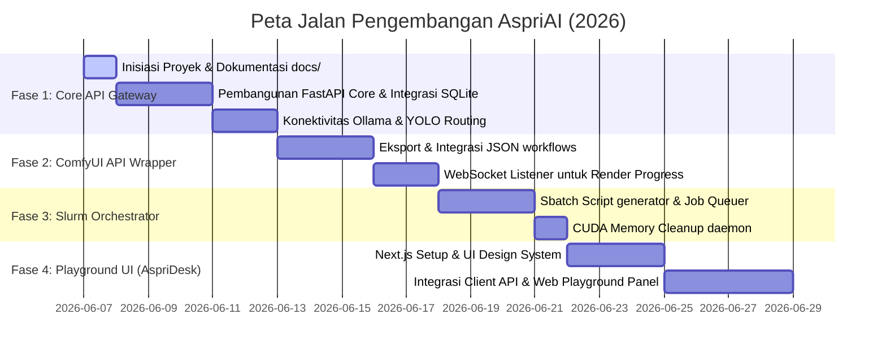

# 📋 Software Development Plan (SDP) — AspriAI

## 1. Fase Pengembangan & Milestone

Proyek **AspriAI (Asisten Pribadi AI)** direncanakan berjalan dalam 4 fase pengembangan yang terstruktur:

---

## 2. Struktur Pengelola Progres (Development Log / Progress Tracking)

### [Entri 001] — Inisiasi Proyek & Dokumen Standar Rekayasa
*   **Tanggal/Waktu:** 2026-06-07 03:09 WIB
*   **Tugas yang diselesaikan:**
    *   Membuat repositori lokal terisolasi untuk AspriAI di direktori `/data/users/g6717500336/singularity/AspriAI`.
    *   Membuat berkas rancangan awal `README.md` yang memuat Laporan Analisis, Konsep Identitas, Network Topology, Rencana Struktur Proyek, Mekanisme API ComfyUI, serta Keuntungan Dekopel.
    *   Menginisialisasi folder `docs/` dan menyusun 5 dokumen standar rekayasa perangkat lunak:
        1.  `SRS.md` (Spesifikasi kebutuhan fungsional & non-fungsional).
        2.  `SDD.md` (Rancangan arsitektur, skema database SQLite, spesifikasi endpoints).
        3.  `SRD.md` (Pemetaan kebutuhan bisnis ke komponen teknis, justifikasi teknologi).
        4.  `STD.md` (Kasus uji / test-case unit, integrasi, dan antarmuka).
        5.  `SDP.md` (Milestone Gantt chart, log kemajuan proyek aktif).
*   **File yang diubah/dibuat:**
    *   `README.md` [DIBUAT BARU]
    *   `docs/SRS.md` [DIBUAT BARU]
    *   `docs/SDD.md` [DIBUAT BARU]
    *   `docs/SRD.md` [DIBUAT BARU]
    *   `docs/STD.md` [DIBUAT BARU]
    *   `docs/SDP.md` [DIBUAT BARU]
*   **Status saat ini:** **Selesai (Fase Inisiasi 100%)**
*   **Catatan untuk AI selanjutnya (Handoff Note):**
    *   Dokumentasi blueprint dan cetak biru arsitektur lengkap telah terpasang di dalam folder `docs/`.
    *   Langkah berikutnya yang harus dilakukan adalah melangkah ke **Fase 1 (Pembangunan Core API Gateway)**:
        1.  Masuk ke direktori `aspri-core/`.
        2.  Membuat virtual environment python / conda.
        3.  Membangun file inisiasi server `app.py` menggunakan FastAPI.
        4.  Mengintegrasikan SQLite database (`sqlite3` / SQLAlchemy) untuk melayani penyimpanan tabel `api_keys` dan `activity_logs`.
        5.  Memastikan port FastAPI tidak bertabrakan dengan layanan lain (port default 8000 aman, atau gunakan port kustom sesuai konfigurasi).

### [Entri 002] — CI/CD Automation & Remote SSH Configuration
*   **Tanggal/Waktu:** 2026-06-07 11:21 WIB
*   **Tugas yang diselesaikan:**
    *   Mengonfigurasi dan mengaktifkan remote deployment CI/CD otomatis pada `.github/workflows/deploy.yml` untuk backend (`Deploy Backend to GPU Node`) dan frontend (`Deploy Frontend to Web Host`).
    *   Memperbaiki penulisan kunci privat SSH menggunakan pengkodean Base64 (`SSH_PRIVATE_KEY_BASE64`) disertai sanitasi string (`tr -d '\r' | tr -d '\n'`) untuk membypass sensor rahasia dan error format key di runner GitHub.
    *   Merancang konfigurasi otentikasi Cloudflare Access untuk domain `slurm.penelitian.my.id` menggunakan Service Token (`github-actions-aspri`) dengan opsi *Bypass* untuk CI/CD dan silent SSH local.
    *   Melakukan verifikasi koneksi lokal Windows (`ssh KU-Slurm-CF` menggunakan parameter `--id` dan `--secret` di `ProxyCommand`) dan berhasil login langsung ke login node secara instan tanpa membuka peramban web browser.
*   **File yang diubah/dibuat:**
    *   `.github/workflows/deploy.yml` [DIUBAH - OK]
    *   `README.md` [DIUBAH - OK]
    *   `docs/SDP.md` [DIUBAH - OK]
*   **Status saat ini:** **Selesai (Konfigurasi Infrastruktur & CI/CD 100%)**
*   **Catatan untuk AI selanjutnya (Handoff Note):**
    *   Akses server via Cloudflare Tunnel sudah terproteksi penuh dari publik namun meloloskan CI/CD dan SSH lokal ber-token.
    *   Lanjutkan implementasi **Fase 1 (Pembangunan Core API Gateway)** pada folder `aspri-core/`.

### [Entri 003] — Pembersihan Modul Lama & Audit Script Auto-Booking GPU
*   **Tanggal/Waktu:** 2026-06-07 11:59 WIB
*   **Tugas yang diselesaikan:**
    *   Melakukan audit mendalam dan pembersihan total terhadap instansi lama di direktori `/data/users/g6717500336/singularity/` untuk mencegah bentrokan port dan resource dengan arsitektur AspriAI yang baru.
    *   Menghapus direktori proyek lama secara permanen: `lm-studio/`, `ollama/`, dan `open-webui/`.
    *   Menonaktifkan pemanggilan skrip launcher `sbatch_llm_service.sh` dari generator sbatch `book_gpu.py` (baris 144-147) dan file submit job `submit_booking_run.sbatch` (baris 21-24) untuk mencegah inisialisasi tak terduga saat booking GPU diaktifkan kembali.
    *   Mematikan sesi tmux `gpu_booking` (daemon `book_gpu.py`) serta membatalkan job Slurm `6618` (`vnot`) agar resource GPU terbebas penuh (status bersih).
*   **File yang diubah/dibuat:**
    *   `docs/SDP.md` [DIUBAH - OK]
    *   `/data/users/g6717500336/Trainning-Models/MyFineTunning-SlurmMaster/utils/book_gpu.py` [DIUBAH - OK]
    *   `/data/users/g6717500336/Trainning-Models/MyFineTunning-SlurmMaster/utils/submit_booking_run.sbatch` [DIUBAH - OK]
*   **Status saat ini:** **Selesai (Pembersihan Lingkungan Lama 100%)**
*   **Catatan untuk AI selanjutnya (Handoff Note):**
    *   Lingkungan kini benar-benar bersih dan siap untuk inisiasi ulang.
    *   Langkah selanjutnya adalah membangun kembali proyek Ollama secara modular di bawah folder `/data/users/g6717500336/singularity/ollama` yang berdiri sendiri sesuai instruksi user.

